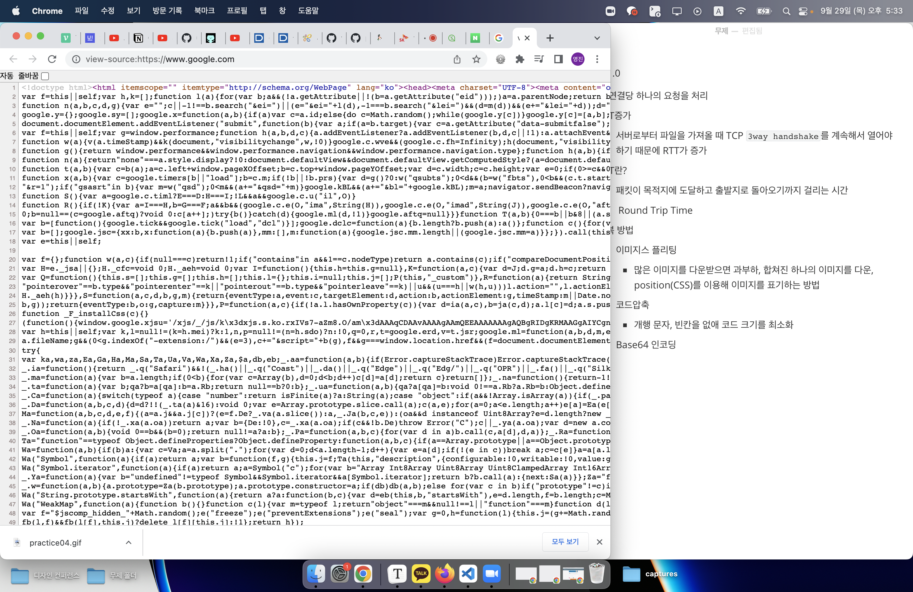

## HTTP/1.0

- 한 연결당 하나의 요청을 처리

- 단점으로 `RTT증가`

  - 서버로부터 파일을 가져올 때 TCP `3way handshake`를 계속해서 열어야하기 때문에 RTT가 증가

- RTT란?

  - 패킷이 목적지에 도달하고 출발지로 돌아오기까지 걸리는 시간
  -  Round Trip Time

- 극복 방법

  - 이미지스 플리팅

    - 많은 이미지를 다운받으면 과부하, 합쳐진 하나의 이미지를 다운, position(CSS)를 이용해 이미지를 표기하는 방법

  - 코드압축

    - 개행 문자, 빈칸을 없애 코드 크기를 최소화

    - 

      구글 메인 홈페이지 코드

  - Base64 인코딩

    - 이미지 파일을 64진법 문자열로 **인코딩,** 서버와 연결을 열고 이미지에 대해 HTTP 요청을 할 필요가 없다

      >인코딩 : 정보 형태나 형식을 표준화를 위해 변환하는 방식

### HTTP/1.1

매번 TCP 연결을 하지 않는다, 한 번 TCP 초기화를 진행 후 keep-alive 옵션으로 여러 파일을 송수신할 수 있다

#### 그러나

**1.x**.버전으로는 `HOL Blocking`문제를 해결할 수 없다.

#### HOL Blocking?

네트워크 상 같은 큐에 있는 패킷이 첫 번째 패킷에 의해 지연될 때 발생하는 성능 저하

## HTTP/2.0

SPDY 프로토콜에서 파생

1.x버전보다 지연시간을 줄이고, 응답시간은 더 빠르게

멀티플렉싱, 헤더 압축, 서버 푸시/요청, 우선순위 처리 지원 

#### 멀티플렉싱

스트림을 여러개 사용해 송수신

특정 스트림 패킷이 손실되더라도 나머지 스트림은 멀쩡하게 동작

> 스트림? 데이터 요소를 가리키는 데이터 흐름

#### 헤더 압축

1.x버전은 헤더의 크기가 커서 문제였다

허프만 코딩 압축 알고리즘 사용해 `HPACK`압축 형식을 갖는다

> 허프만 코딩? 문자열을 문자 단위로 나눔, 빈도가 높은 정보는 적은 비트 수를 사용해 표현, 빈도가 낮은 정보는 비트 수를 많이 사용해 전체 데이터 표현에 필요한 비트양을 줄이는 원리

#### 서버 푸시

HTTP/2는 클라이언트 요청없이 서버가 바로 리소스를 푸시할 수 있다

> HTML을 읽으며 안에 들어 있던 CSS파일을 서버에 푸시해 클라이언트에게 먼저 제공

## HTTP/3

개발자도구 > 네트워크 > 타입에서 확인

프로토콜 `h3`가 HTTP3를 의미

네이버 HTTP/2 구글 HTTP/3

QUIC이라는 계층 위에서 돌아가며 UDP 기반으로 돌아간다

멀티플렉싱 기능이 있고, '초기 연결 설정 시 지연 시간 감소'라는 대표적 특징

> TCP를 사용하지 않기 때문에 3웨이 핸드쉐이크과정을 거치지 않는다
>
> 첫 연결 설정에 1-RTT만 소요, 클라이언트가 서버에 신호를 한 번 준다면, 서버도 바로 응답해 통신이 가능

순방향 오류 수정 메커니즘

- 전송 패킷이 손실되었다면 수신측에서 에러를 검출하고 수정하는 방식
- 낮은 패킷 손실률