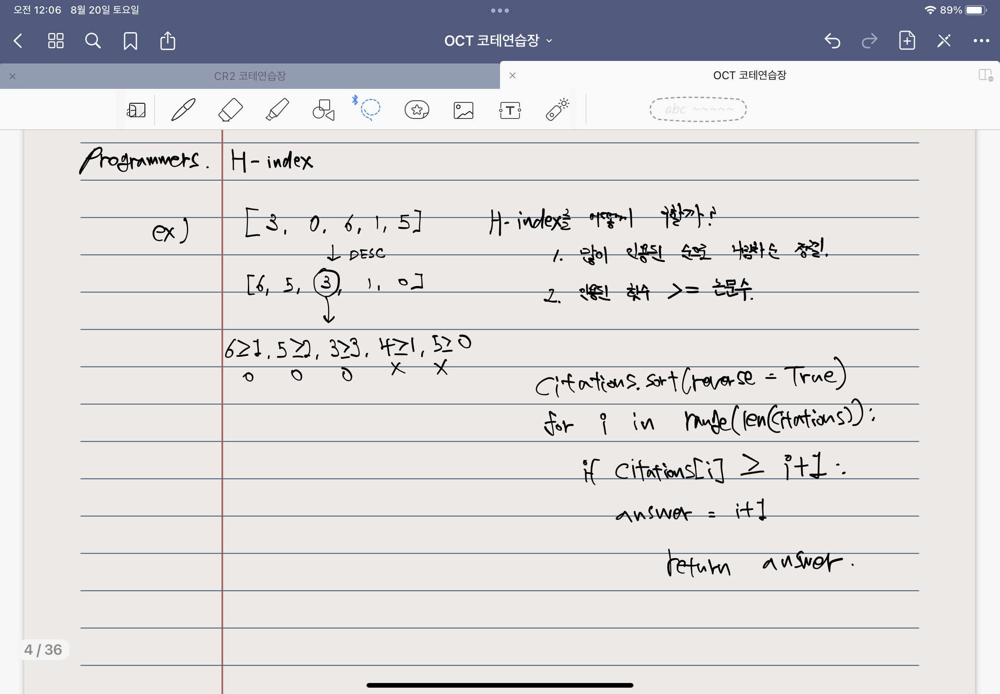

## Programmers. H-index

### 풀이법



```python
# Programmers. 정렬. H-index

def solution(citations):
    citations.sort(reverse = True) # 인용횟수 DESC
    answer = 0

    for i in range(len(citations)):
        if citations[i] >= i + 1: # 인용된 횟수 >= 논문수
            answer = i + 1 # 값 갱신
        
    return answer # 리턴
```

