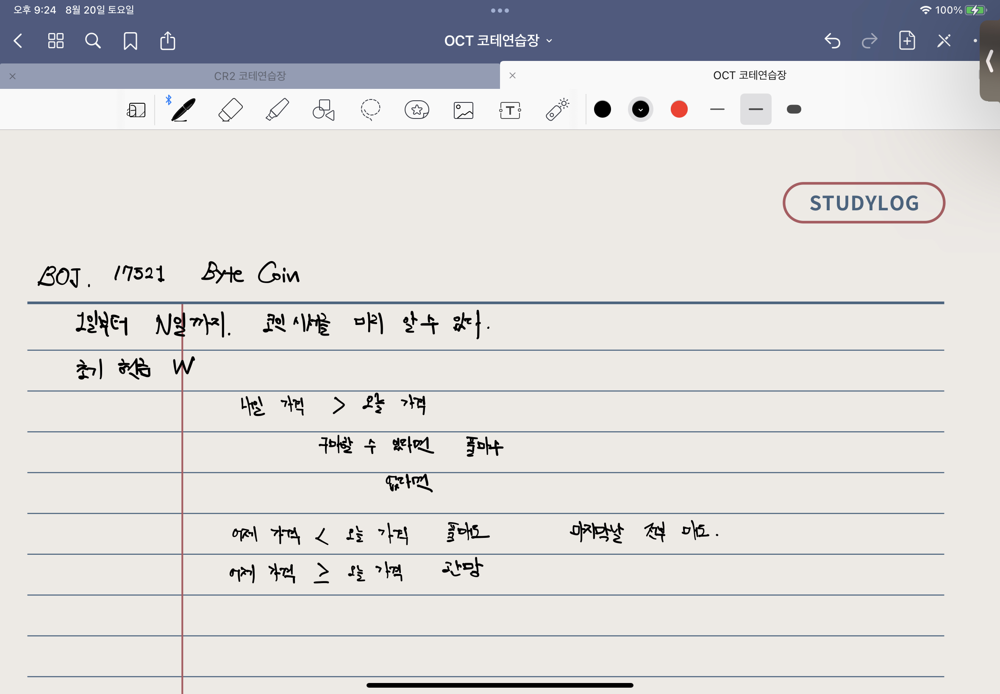

## BOJ 17521. 바이트 코인

### 풀이법



```sql
# BOJ 17521. 바이트 코인
day, balance = map(int(input().split()))
btc = 0 # 바이트코인 보유 
price = [] # 시세

for _ in range(day):
    price.append(int(input()))

for i in range(day-1):

    if price[i] < price[i+1]: # 내일 가격이 오늘보다 더 높다면
        if balance // price[i] > 0: # 구매할 수 있다면
            btc = balance // price[i] # btc 개수
            balance -= btc * price[i] # 풀매수
        elif balance // price[i] <= 0: # 구매할 수 없다면
            pass

    elif price[i-1] < price[i]: # 오늘 가격이 어제보다 더 높다면
        balance += btc * price[i] # 풀매도
        btc = 0  # 지갑 초기화

    elif price[i-1] >= price[i]: # 어제 가격이 같거나 높다면
        pass # 관망

if btc > 0: # 마지막 날 정리
    balance += btc * price[-1]

print(balance) # 최종 계좌 잔고
```

