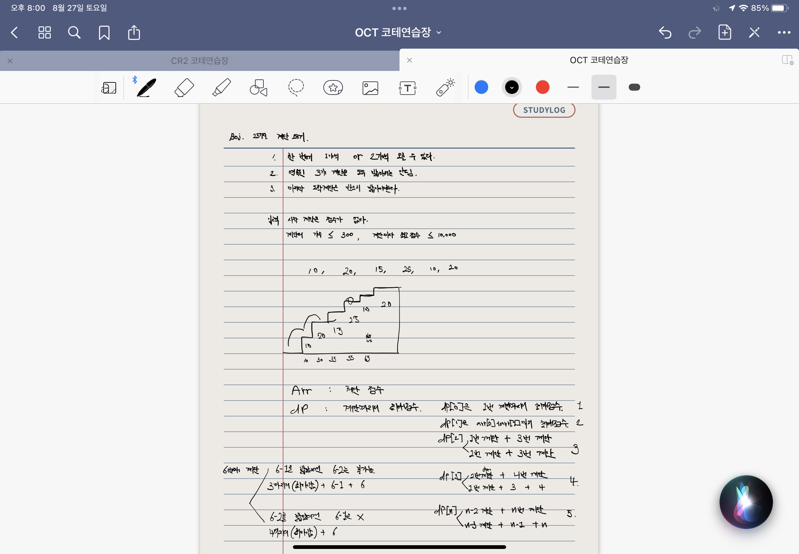

## BOJ_2579 - 계단 오르기

### 풀이법



```python
N = int(input()) # 계단 개수 입력
stair = [0] * 300 # 계단 점수
score = [0] * 300 # n번째 계단까지의 최대 점수

for i in range(N): 
    stair[i] = int(input()) # i번째 계단의 점수를 입력

score[0] = stair[0] # 1번째 계단의 최고 점수 = 첫번째 계단 값
score[1] = stair[0]+stair[1] # 2번째 계단의 최고 점수 = 1번째 + 2번째
score[2] = max(stair[2]+stair[1], stair[2]+stair[0]) # 3번째 계단의 최고 점수 = 2번째 + 3번째 or 1번째 + 2번째

'''
n-3번째 계단까지의 최고 점수 + n-1번째 계단 + n번째 계단 (5, 6을 밟는 경우)
vs
n-2번째 계단까지의 최고 점수 + n번째 계단 (4, 6을 밟는 경우)
'''

for i in range(3, N):
    score[i] = max(score[i-3]+stair[i-1]+stair[i], score[i-2]+stair[i])

print(score[N-1]) # 최종 계단까지의 최고 점수 출력
```

